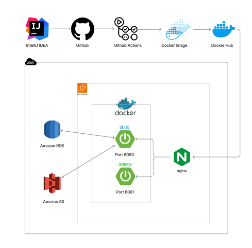

# 🌎 BlockGuard-server

 AI를 활용한 보이스피싱 사전예방 통합 서비스 **BlockGuard**의 서버 레포지토리입니다.  

---

## 📌 Package Structure

## 📌 ERD (Entity Relationship Diagram)
- [ERD Diagram Link](https://dbdiagram.io/d/BlockGuard_ERD-686d1997f413ba3508d99080)
  

  테이블 별 용도

- **User**: 서비스의 기본 사용자 정보를 저장 (계정, 개인정보, 상태 관리)
- **Guardian**: 사용자의 보호자(연락망) 정보를 저장, 다수 가능
- **NewsArticle**: 보이스피싱/사기 관련 뉴스 기사 수집 및 조회용 데이터
- **FraudPhoneNumber**: 사기 의심 전화번호 저장 및 API 검증 기록
- **FraudUrl**: 사기 의심 URL 저장 및 감지 시각 관리
- **UserReportRecord**: 사용자가 진행 중인 신고 프로세스의 전체 레코드
- **ReportStepProgress**: 신고 프로세스 각 단계의 진행 상황 기록
- **ReportStepCheckbox**: 단계별 필수/권장 체크박스 항목의 완료 여부 기록
- **FraudAnalysisRecord**: AI 분석 결과(사기 유형, 점수, 위험도)를 저장

---

## 📌 API 명세서
- [API 명세서 (Swagger 링크)](https://www.blockguard.shop/swagger-ui/index.html)
- [API 명세서 (Notion 링크)](https://breezy-index-18b.notion.site/API-253ec5aa3e1a8014a18dc53ee1d1c5c8)

---

## 📌 Architecture Diagram

- 서비스 전체 아키텍처 다이어그램

- 서버 아키텍처 다이어그램
